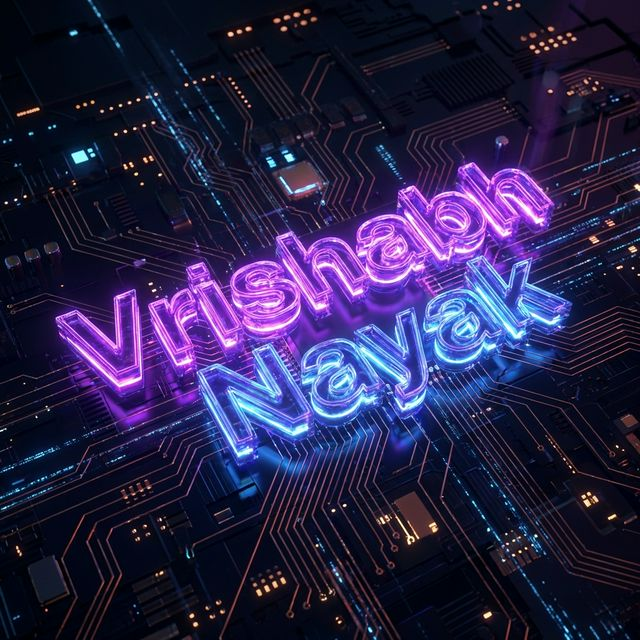

  

<!-- 🎯 TYPING ANIMATION -->

  

 

<!-- 🖼️ ABOUT SECTION WITH GIF -->
<table align="center" border="0" cellpadding="0" cellspacing="0">
<tr>
<td width="55%" valign="top">

### 🧑‍💻 &nbsp;About Me

&nbsp;&nbsp;&nbsp;💡 A curious mind exploring the endless possibilities of code and creativity.\
&nbsp;&nbsp;&nbsp;🎓 Computer Science student passionate about building real-world tech.\
&nbsp;&nbsp;&nbsp;🛠️ Currently crafting **Griffora** — a generative AI project merging design & intelligence.\
&nbsp;&nbsp;&nbsp;🌱 Focused on becoming a **full-stack leader**.\
&nbsp;&nbsp;&nbsp;✨ Exploring **UI/UX** + **Backend APIs**.\
&nbsp;&nbsp;&nbsp;🚀 Always learning, always building — dreaming big and developing bigger.

</td>
<td width="45%" align="center">

</td>
</tr>
</table>

 

<!-- ✦ DIVIDER -->

<!-- 🌟 FEATURED PROJECTS -->
<h2 align="center">🚀 Featured Projects</h2>

<table>
<tr>
<td align="center" width="50%">

  

<b>Exploring generative AI, tech trends & global growth</b>

  
  

</td>
<td align="center" width="50%">

  

<b>Purchase platform for gamers to build dream setups</b>

  
  

</td>
</tr>
</table>

 

<!-- ✦ DIVIDER -->

<!-- �️ TECH STACK -->
<h2 align="center">⚡ Tech Arsenal</h2>

#### 🌐 Frontend

#### ⚙️ Backend & Database

#### 🎨 Design & Tools

 

<!-- ✦ DIVIDER -->

<!-- 📊 GITHUB STATS -->
<h2 align="center">📊 GitHub Stats</h2>

  
  &nbsp;&nbsp;
  

 

  

 

<!-- 🐍 CONTRIBUTION SNAKE -->

  <picture>
    <source media="(prefers-color-scheme: dark)" srcset="https://raw.githubusercontent.com/platane/snk/output/github-contribution-grid-snake-dark.svg" />
    <source media="(prefers-color-scheme: light)" srcset="https://raw.githubusercontent.com/platane/snk/output/github-contribution-grid-snake.svg" />
    
  </picture>

 

<!-- ✦ DIVIDER -->

<!-- 🏆 GITHUB TROPHIES -->
<h2 align="center">🏆 GitHub Trophies</h2>

  

 

<!-- ✦ DIVIDER -->

<!-- 📫 CONNECT WITH ME -->
<h2 align="center">🤝 Connect with Me</h2>

  &nbsp;
  &nbsp;
  &nbsp;
  

 

<!-- � PROFILE VIEWS -->

  

 

<!-- ✨ RANDOM DEV QUOTE -->

  

 

<!-- 🔮 ANIMATED FOOTER -->

  

